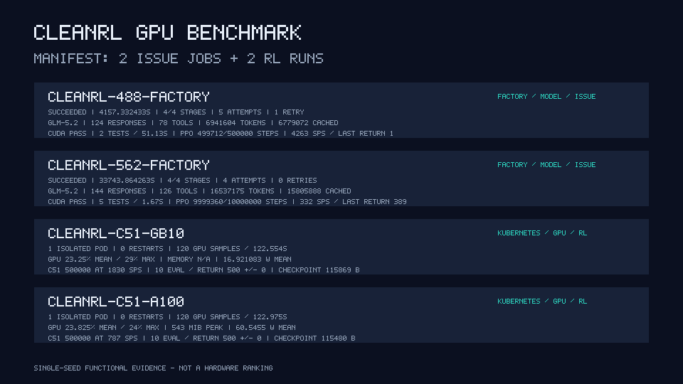

# CleanRL GPU Benchmark Report

## Outcome

Software Factory completed two CleanRL issue implementations with Z.AI
GLM-5.2, then ran a real CUDA-backed train-checkpoint-evaluate loop on each of
two Kubernetes GPU hosts. Nothing in the RL path was mocked.

- [CleanRL #488: Support ToyText env](https://github.com/vwxyzjn/cleanrl/issues/488)
  ran on Linux ARM64 with an NVIDIA GB10.
- [CleanRL #562: GAE Bug for EnvPool: Dummy Step Leak](https://github.com/vwxyzjn/cleanrl/issues/562)
  ran on Linux AMD64 with an NVIDIA A100-SXM4-40GB.
- Both Factory jobs completed plan, execute, review, and remediation with a
  durable checkpoint after every stage.
- Both product-validation runs trained CleanRL C51 on CUDA for 500,000 steps,
  saved a PyTorch checkpoint, and evaluated ten episodes.

## Factory and model execution

| Issue | Factory wall time | Attempts | Retries | GLM-5.2 responses | Tools | Total tokens | Output tokens |
| --- | ---: | ---: | ---: | ---: | ---: | ---: | ---: |
| #488 / GB10 | 4,157.332 s | 5 | 1 | 124 | 78 | 6,941,604 | 32,944 |
| #562 / A100 | 33,743.864 s | 4 | 0 | 144 | 126 | 16,537,175 | 127,927 |

The #488 job recorded 6,908,660 input tokens, of which 6,779,072 were cached,
and 16,554 reasoning-output tokens. The #562 job recorded 16,409,248 input
tokens, of which 15,805,888 were cached, and 100,884 reasoning-output tokens.
Neither job emitted a context-compaction event. These values come from exact
per-completion Codex usage counters, not estimates from text length.

## Issue correctness gates

| Issue | CUDA optimizer step | Focused tests | PPO completion | Final SPS | Last training return |
| --- | --- | ---: | ---: | ---: | ---: |
| #488 | Passed | 2 in 51.13 s | 499,712 rollout-aligned steps from 500,000 configured | 4,263 | 1.0 |
| #562 | Passed | 5 in 1.67 s | 9,999,360 rollout-aligned steps from 10,000,000 configured | 332 | 389.0 |

The #488 patch adds discrete-observation support without removing Box-space
behavior. The #562 patch masks GAE bootstrapping and lambda recurrence when a
transition is terminal or the current EnvPool observation is a dummy step.
Both patches apply cleanly to pinned CleanRL revision
`fe8d8a03c41a7ef5b523e2e354bd01c363e786bb`:

- [issue-488.patch](patches/issue-488.patch): 2,790 bytes, SHA-256
  `ac3e70ece34c0936b5a62b1f7c3199badadf98cc42a49ee289b8e9fce996bc9f`
- [issue-562.patch](patches/issue-562.patch): 11,477 bytes, SHA-256
  `aef772631b26518d31f52e8e9a5b9c289c5cfa45bf48d98a31d050ace661777d`

The #562 completion receipt proves the configured 10,000,000-step command
exited successfully; CleanRL's rollout loop completed 9,999,360 steps and its
last emitted training event was at 9,995,448. PPO returns above are training
signals, not evaluation scores.

## Real RL product-validation runs

| Device | Final logged step | SPS | Evaluation return | GPU samples | GPU utilization mean / max | Memory peak | Power mean / max | Checkpoint |
| --- | ---: | ---: | ---: | ---: | ---: | ---: | ---: | ---: |
| NVIDIA GB10 | 499,779 | 1,830 | 500.0 +/- 0.0 (10 episodes) | 120 over 122.554 s | 23.25% / 29% | unavailable | 16.921 W / 17.38 W | 115,869 B |
| NVIDIA A100-SXM4-40GB | 499,585 | 787 | 500.0 +/- 0.0 (10 episodes) | 120 over 122.975 s | 23.825% / 24% | 543 MiB | 60.5455 W / 61.14 W | 115,480 B |

The algorithm logs periodically, so the last `global_step` precedes the exact
500,000-step boundary. An exit-zero completion receipt, nonempty loadable
checkpoint, and ten indexed evaluation episodes prove completion. Checkpoint
SHA-256 values are:

- GB10: `a1d9aed0d40e186788703a9a6331137f2c2336635eabf14bb68f9411bd17168a`
- A100: `31e05405151ead79ca89b3a5a1d9e3daa7ea3f9c253a2c8cb34df33d8167b75e`

For each row, Kubernetes state, timestamped GPU samples, CUDA receipt, RL log,
evaluation, and checkpoint came from one isolated product-validation Pod. The
GB10 receipt came from a custom preflight that asserted both parameters
changed; the A100 legacy receipt records positive weight and bias deltas. The
current manifest defines the deterministic reproduction command and does not
claim those measured receipts were byte-identical. Each Pod requested one GPU,
used the NVIDIA RuntimeClass, mounted one job-specific workspace, and recorded
zero restarts. This is Kubernetes Pod and workspace isolation, not Kata or VM
isolation.

## Provenance and limitations

The manifest pins the CleanRL source, provider/model profile, dependency
inputs, platform, GPU assignment, and image digests. The measured GB10 image
was node-local at
`docker.io/library/software-factory-gpu@sha256:a5e2582363acdbf172e1ebac1c5ba1de87a0fcb7420d655263b0477fa9861557`;
the public ARM64 reproduction image is
`ghcr.io/fpolica91/software-factory@sha256:a1ee9c9920eb45cbe8362b6aa1b34c34207322b52b280b0a5428315e6d6c09a1`.
The measured A100 image is public at
`ghcr.io/fpolica91/software-factory@sha256:ae8a2aac52a5fd32489e16812113092fe21c931b2167968a2fd93811c26c2c01`.
The report does not claim distinct digests are identical.

`factory_revision=6e967bb67a92944ecdfa9b5884cc1924f2dbecba` identifies the
public benchmark scaffold. The measured coordinator was built from the local
worktree, so that field is not an exact control-plane binary identity.

The manifest retains `submitted_task_sha256` for the exact measured job and
`reproduction_task_sha256` for the improved checked-in prompt as submitted by
the documented shell command. The collector accepts only those two explicit
hashes. The reproduction prompt is intentionally not represented as
byte-identical to the historical task.

This demonstrates independent single-GPU workloads dispatched to two hosts.
It is not distributed RL, multi-GPU training, or a controlled hardware
benchmark: platform, dependency, and image stacks differ, and only one seed
was run. The results establish functional orchestration, isolation, durable
stages, real CUDA execution, checkpointing, and evaluation; they do not rank
the GPUs or establish statistical reliability.
